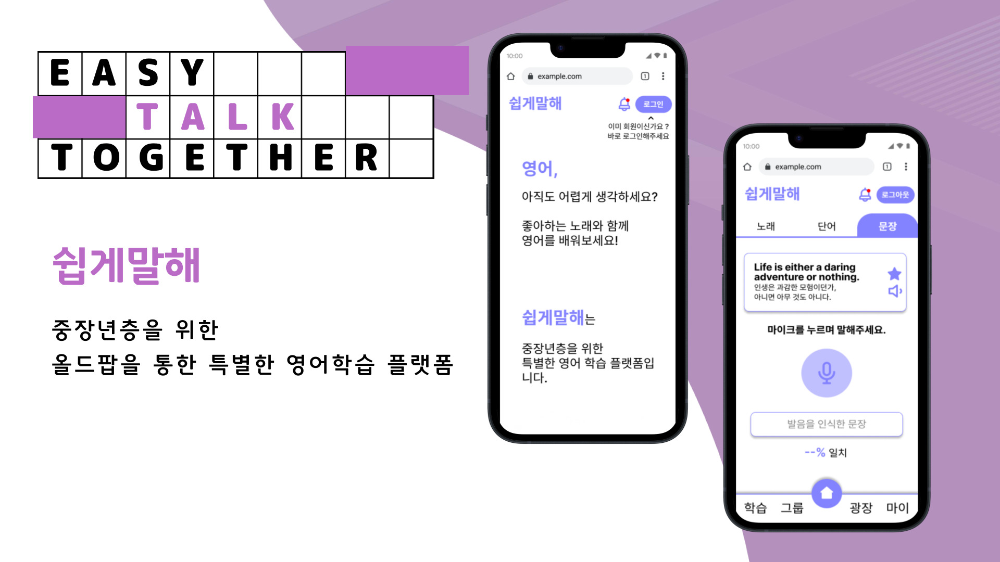
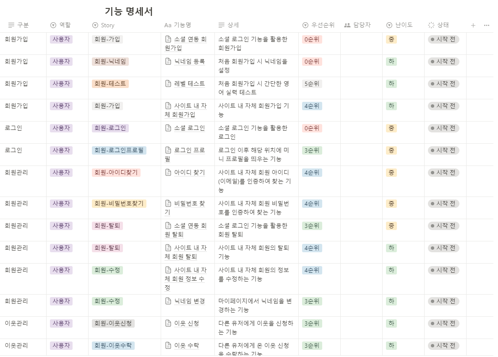
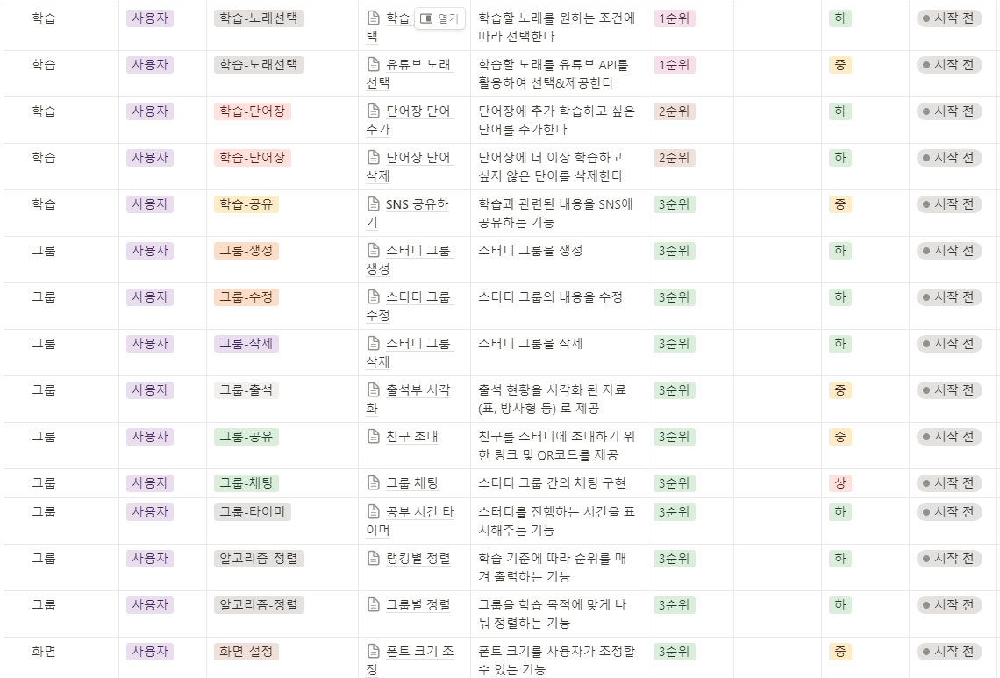
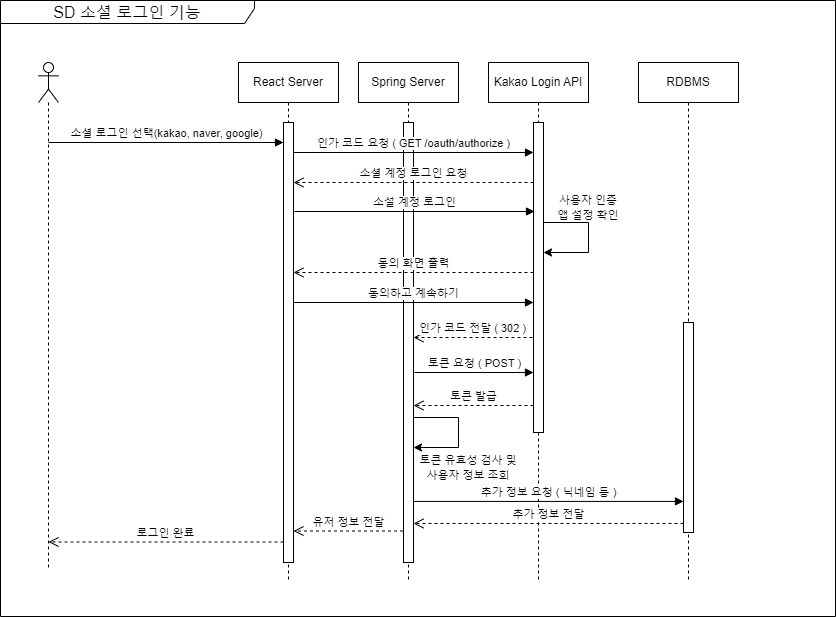
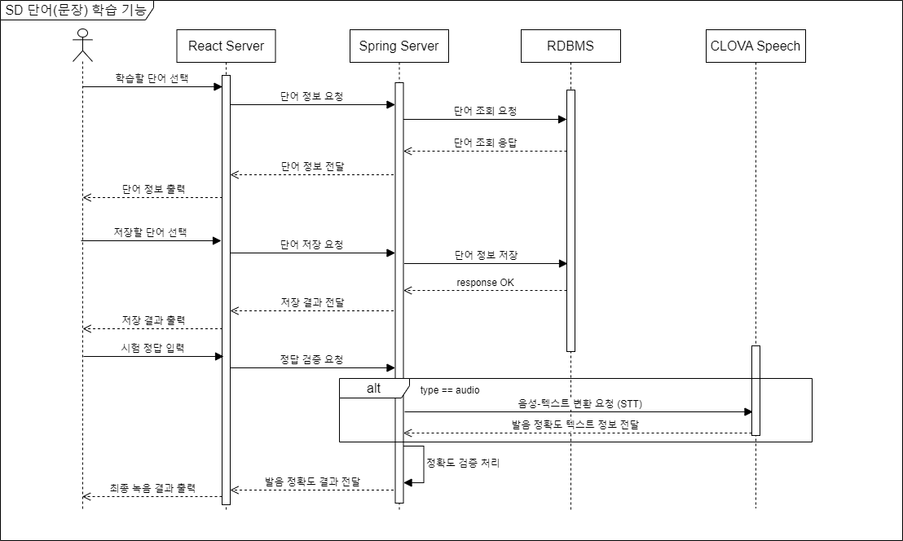
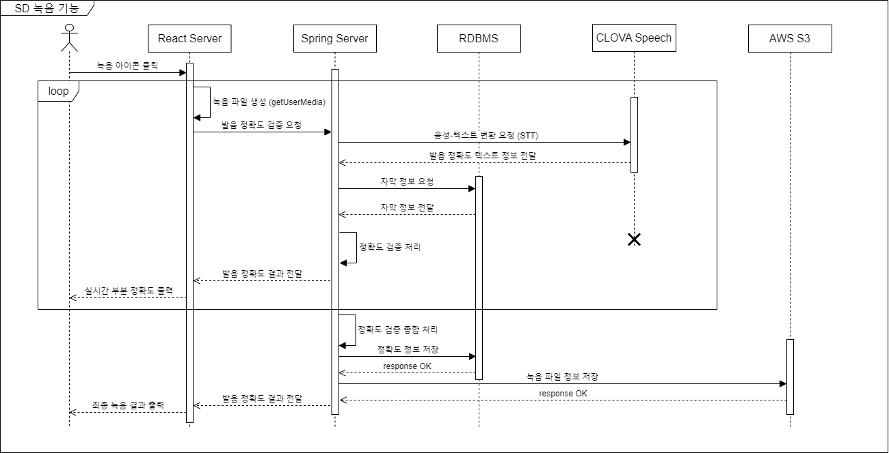
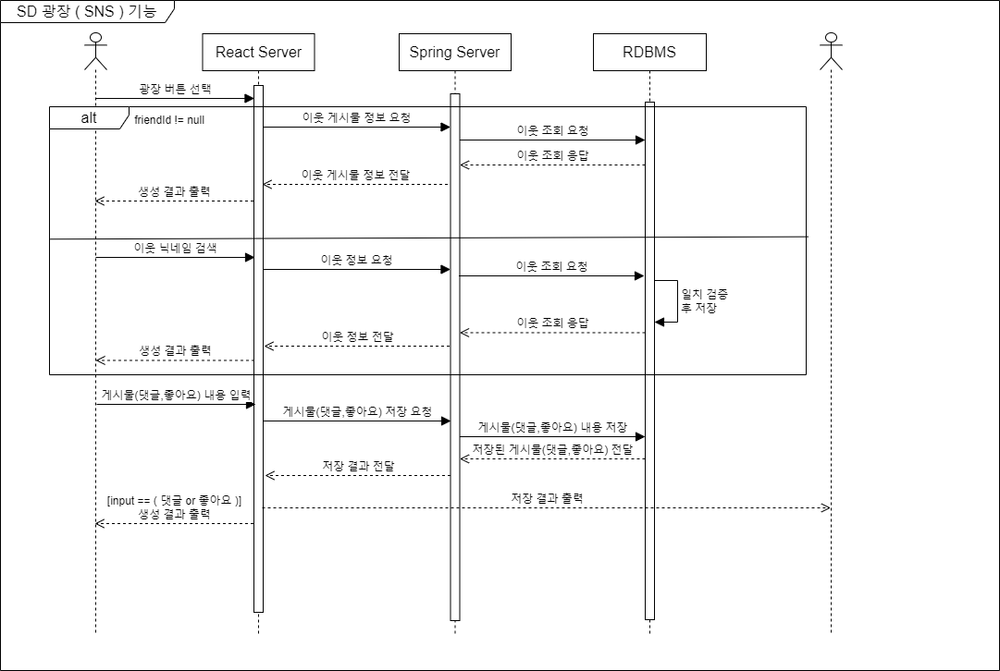
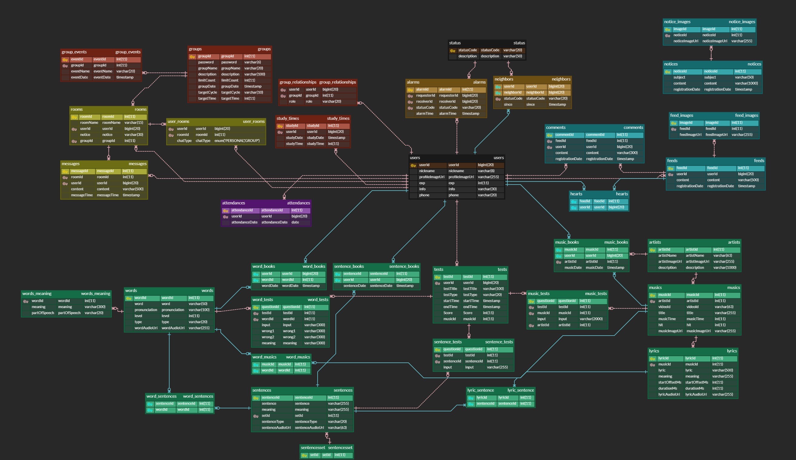

# 💬🎤 쉽게말해 (EASYTALK)



<br /><br />

# 목차

1. [개요](#개요)
2. [프로젝트 소개](#프로젝트-소개)
3. [서비스 화면](#서비스-화면)
4. [주요 기능](#주요-기능)
5. [협업 환경](#협업-환경)
6. [기술 소개](#기술-소개)
7. [팀원 소개](#팀원-소개)

<br /><br />

# 개요

**SSAFY 10기 2학기 공통 프로젝트**

저희 **쉽게말해**는 중장년층분들이 영어를 쉽고 재미있게 배울 수 있도록 만들어졌습니다. <br /><br />
영어에 익숙하지 않으신 분들도 수준에 맞춰 천천히 진행되며 <br /><br />
`단어`, `문장`뿐만아니라 `상황별 영어대화법`, 그리고 사용자의 흥미를 일으키기위해 엣 추억을 회상하며 `올드팝`으로 영어를 배울 수있는 서비스를 제공하고있습니다. <br /><br />
저희는 중장년층 분들이 영어를 통해 새로운 세상을 경험하고, 새로운 사람들과 만나는 것을 돕기 위해 다양한 학습 자료를 제공하고 있습니다. <br /><br />
새로운 도전을 통해 더 넓은 세상을 경험하고, 새로운 사람들을 만나며 이제 당신의 두 번째 인생에 활력을 불어넣는 여행의 시작을 도와드리기 위해 기획하게 되었습니다.

개발기간 : 2024.01.03 ~ 2024.02.16 (7주)

<br /><br />

# 프로젝트 소개

### 📋 서비스명

- 쉽게말해 (EASYTALK)

### 🎯 페르소나

- 팝송을 좋아하고 영어를 배우고싶은 중장년층

### 🎵 주요 서비스

- 단계별 학습 : 단어 -> 문장 -> 노래로 이루어진 단계별 학습 서비스
- 올드팝을 통한 학습 : 노래를 통해 영어를 배우며 발음 일치도 평가 서비스
- 실생활 표현 학습 : 상황에 따른 실생활 문장 표현 학습 서비스

### 🗺️ 배포 주소

- 프론트 서버 : https://i10b307.p.ssafy.io/ <br />
- 백엔드 서버 : https://i10b307.p.ssafy.io:8080/ <br />

## 📊 기획/설계

### 📑 기능 명세서






### 📊 Sequence Diagram

**로그인 기능**



**단어 학습 기능**



**데이터 요청 기능**


**녹음 기능**



**광장 기능**



### 💻 코딩 컨벤션

**코딩 컨벤션 이란?**

코드를 작성할 때 일관된 형식과 스타일을 따르도록 하는 규칙이나 가이드라인

<details>
  <summary>1. 공통 코드</summary>

- 들여쓰기

  1. space 와 tab 을 섞어서 사용하지 않는다.
  2. 들여쓰기는 두 칸

  ```
  public static void main(String[] args) {
    // Indentation
  }
  ```

- 변수 및 함수 이름

  **★변수, 함수에 대한 의미를 명확하게 네이밍!!★**

  **★함수이름은 동사로시작 get**, set**, find\_\_★**

  1. 예약어를 사용하지 않는다.

  ```
  // bad
  let true = true;

  // good
  const flag = true
  ```

  2. Magic number (숫자 하드코딩X)

  ```
  // bad
  let km = 10 * 1609.344;

  // good
  const MILE= 1609.344;
  let km = 10 * MILE;
  ```

  3. 한 글자 변수X

  ```
  // bad
  let a = 0;

  // good
  let temp = 0;

  // good
  for (let i = 0; i < 10; i+) {
    // 반복문 같은 임시변수는 한글자 사용가능
  }
  ```

- 문장의 종료

  1. 한 줄에 하나의 문장만 허용

  ```
  // bad
  log.consloe("123"); log.consloe("456");

  // good
  log.consloe("123");
  log.consloe("456");
  ```

  2. 문장 종료 시 세미콜론(;)을 사용한다 -> 가독성

  ```
  // bad
  log.console("세미콜론 쓰자!");

  // good
  log.consloe("세미콜론 잘쓰자!");
  ```

- 선언과 할당

  사용 시점에 선언 및 할당한다.

  ```
  let minValue;

  // bad
  minValue = Math.min(5, 10, 15);

  // good
  let maxValue= Math.max(5, 10, 15);
  ```

- 공백

  1. 제어문 (if while)

  ```
  // bad
  if(condition)

  // good
  if (condition)
  ```

  2. 연산자

  ```
  // bad
  const SERVICE_KEY= 'DKFJ2123';

  // good
  const SERVICE_KEY = 'DKFJ2123';
  ```

  3. 중괄호 -> 여는 중괄호 다음 공백

  ```
  // bad
  const var = {charile: '1'};

  // good
  const var = { charile: '1' };
  ```

- 주석 (comments)

  모든 주석은 공백으로 시작한다

  1. 한 줄 주석

  ```
  // bad
  //comment

  // good
  // comment
  ```

  2. 여러 줄 주석

  ```
  // bad
  /**
  *comment
  *comment
  */

  // good
  /**
  * comment
  * comment
  */
  ```

- 명명 규칙(Naming Conventions)

  1. DB

  ```
  접미사 list - DB
    CNT : count 조회수 등의 count에 사용됩니다.
    DT : date 날짜인 경우를 나타냅니다.
    FK : foreign key를 나타내는 데 사용합니다.
    FL : flag 0, 1로 구성된 상태를 나타냅니다.
    ID : id 계정 등의 아이디를 나타냅니다.
    NM : name 이름, 별명 등 식별 가능하며 중복이 가능한 문자열 나타내는 데 사용합니다.
    NO : number 나이, 휴대폰 번호 등 숫자를 나타냅니다.
    ORD : order 정렬에 사용되는 index를 나타냅니다.
    PK : primary key를 나타내는 데 사용합니다.
    ST : status 회원의 등급, 성별 등의 상태를 나타냅니다.
  ```

  2. 변수

  ```
  cnt : count
  var : variable
  tmp : temp
  no? num? : number
  flag : flag?
  date : date
  id : identification
  pw : password
  str : string?
  for 임시변수 문 순서 i -> j -> k - l?

  //GPT
  user - 사용자 정보를 나타내는 객체
  post - 게시물을 나타내는 객체
  comment - 댓글을 나타내는 객체
  like - 좋아요를 나타내는 객체
  follow - 팔로우 관계를 나타내는 객체
  message - 메시지를 나타내는 객체
  notification - 알림을 나타내는 객체
  group - 그룹을 나타내는 객체
  tag - 태그를 나타내는 객체
  image - 이미지를 나타내는 객체
  video - 비디오를 나타내는 객체
  audio - 오디오를 나타내는 객체
  event - 이벤트를 나타내는 객체
  location - 위치 정보를 나타내는 객체
  messageCount - 메시지 수를 나타내는 변수
  unreadCount - 읽지 않은 것을 나타내는 변수
  active - 활성 상태를 나타내는 변수
  deleted - 삭제 여부를 나타내는 변수
  createdAt - 생성 일자를 나타내는 변수
  updatedAt - 수정 일자를 나타내는 변수
  ```

- 라인 길이 제한: 100

  1. Visual Studio Code
     
  2. Intellij

     [Intellij_Line_Limit](https://github.com/google/styleguide/blob/gh-pages/intellij-java-google-style.xml)

- 수직 개행

  필드, 생성자, 함수, 중첩메소드, 개행

  ```
  public class ExampleClass {

      // Fields with optional blank lines between them (logical groupings)
      private int field1;
      private String field2;

      // Constructor
      public ExampleClass(int field1, String field2) {
          this.field1 = field1;
          this.field2 = field2;
      }

      // Method with blank line before and after for readability
      public void performAction() {
          // code for action
      }

      // Static initializer
      static {
          // static initialization code
      }

      // Instance initializer
      {
          // instance initialization code
      }

      // Nested class
      private static class NestedClass {
          // code for nested class
      }

      // Another field group separated by an optional blank line
      private boolean field3;
      private double field4;

  }
  ```

- if 중괄호 명시

  `if` 명령문은 항상 중괄호 명시

  ```
  //bad
  if (condition) console.log("bad");

  //good
  if (condition) {
    console.log("good");
  }
  ```

- 연산자 괄호

      괄호를 사용하여 연산자 순서를 명확하게 하기
      ```
      // bad
      if (a == b && c == d)

      // good
      if ((a == b) && (c == d))
      ```

  </details>

<details>
  <summary>2. JAVA</summary>

- 변수 및 함수 이름

  1. 클래스 : **PascalCase**
  2. 메소드 / 생성자 / 객체 / 변수 : **lower Camel Case**
  3. 상수 : 대문자 + `_`
  4. 패키지-디렉토리명 : 소문자

  ```
  **com
  │
  ├── user
  │   │
  │   └── controller
  │ 	│
  │ 	└── service
  └── board
      │
      └── controller**
  ```

- 자바 @Override 명시

  ```
  class Animal {
    void makeSound() {
        System.out.println("Some generic sound");
    }
  }

  // bad
  class Cow extends Animal {

      void makeSound() {
          System.out.println("moo");
      }
  }

  // good
  class Dog extends Animal {
      @Override
      void makeSound() {
          System.out.println("Bark! Bark!");
      }
  }
  ```

- Annotation

  어노테이션은 각 1줄이다.

  ```
  @Override
  @Nullable
  public String getNameIfPresent() { ... }
  ```

- 자바 접근제한자 순서

  1. **public**
  2. **protected**
  3. **private**
  4. **abstract**
  5. **default**
  6. **static**
  7. **final**
  8. **transient**
  9. **volatile**
  10. **synchronized**
  11. **native**
  12. **strictfp**

- static 멤버 호출

  ```
  // bad
  Integer integer = new Integer();
  int maxValue = integer.MAX_VALUE;

  // good
  int maxValue = Integer.MAX_VALUE;
  ```

  </details>

<details>
  <summary>3. JavaScript</summary>

- 변수 및 함수 이름

  - 변수명 작성 규칙
    1. 객체 / 함수 / 인스턴스 : PascalCase
    2. 클래스 / 생성자 : camelCase
    3. 상수 : SNAKE_CASE
  - 패키지-디렉토리명
    1. 패키지 이름은 소문자로 작성
    2. 여러 단어는 하이픈(`-`)을 사용하여 구분
  - 변수 선언 키워드 => 기본적으로 const 사용을 권장
    ```
    const : 재할당, 재선언 : 불가능
    let : 재할당 가능, 재선언 불가능
    ```

- 공백

  객체 리터럴

  ```
  // bad
  var obj1 = { var: 1};
  var obj2 = { var:1};

  // good
  var obj = { var: 1};
  ```

- 배열

  1. 배열을 생성할 때 `리터럴 표기법` 사용

  ```
  // bad
  const items = new Array();

  // good
  const items = [];
  ```

  2. 배열에 직접 값을 할당하지 말고 `Array.push` 사용

  ```
  const arr = [];

  // bad
  arr[arr.length] = 'abcded';

  // good
  arr.push('abcded');
  ```

  3. 배열을 복사할 때는 배열 전개 구문 `...` 사용

  ```
  // bad
  const len = items.length;
  const itemsCopy = [];
  let i;

  for (i = 0; i < len; i += 1) {
    itemsCopy[i] = items[i];
  }

  // good
  const itemsCopy = [...items];
  ```

- 객체 비구조화 사용

  하나의 객체에서 여러 속성에 접근할 때는 **객체 비구조화**를 사용

  ```
  // bad
  function getFullName(user) {
    const firstName = user.firstName;
    const lastName = user.lastName;

    return `${firstName} ${lastName}`;
  }

  // good
  function getFullName(user) {
    const { firstName, lastName } = user;
    return `${firstName} ${lastName}`;
  }

  // best
  function getFullName({ firstName, lastName }) {
    return `${firstName} ${lastName}`;
  }
  ```

- 문자열

  1. 문자열에는 큰 따옴표 `"문자열"`를 사용

  ```
  // good
  const name = "Capt. Janeway";

  // bad - 백틱
  const name = `Capt. Janeway`;

  // bad
  const name = 'Capt. Janeway';ㅍ
  ```

  2. 문자열을 생성하는 경우 문자열 연결 대신 `템플릿 문자열`을 사용

  ```
  // bad
  function sayHi(name) {
    return 'How are you, ' + name + '?';
  }

  // bad
  function sayHi(name) {
    return ['How are you, ', name, '?'].join();
  }

  // bad
  function sayHi(name) {
    return `How are you, ${ name }?`;
  }

  // good
  function sayHi(name) {
    return `How are you, ${name}?`;
  }
  ```

- 코드 그룹화 및 모듈화

  상대 경로는 사용하지 않는다.

  ```
  // bad
  const StyleGuide = require('./StyleGuide');
  module.exports = StyleGuide.es6;

  // ok
  import StyleGuide from './StyleGuide';
  export default StyleGuide.es6;

  // best
  import { es6 as BestStyle } from './StyleGuide';
  export default BestStyle;
  ```

- 함수 표현식

      화살표 함수 사용
      ```
      // bad
      const getSumFuntion = function getSum(arr){ // Function expression
        return arr.length;
      }

      // good
      const getSum = (a, b) => {
        retrun a + b;
      }
      ```

  </details>

<details>
  <summary>4. React</summary>

- Memoizaion

  1. 컴포넌트 props로 넘겨주는 값은 useMemo()
  2. 함수는 useCallback()
  3. 만약, props를 받는 컴포넌트가 memo()로 감싸진 컴포넌트라면 무조건 memoizion 하기

- Event Handler

  1. prop이름 : on\_\_\_
  2. 이벤트 함수 이름 : handle\_\_\_

- Custom Hook

  1. 이름 : use\_\_\_
  2. Custom Hook 내부에서는 JSX 사용을 지양
  3. React Hook 또는 JavaScript 로직을 사용

    <details>
    <summary>import export 모듈 컨벤션</summary>

  - import 순서

    1. React 관련 모듈

    ```
    import React from 'react';
    import PropTypes from 'prop-types';
    import { withRouter } from 'react-router-dom';
    // 다른 React 관련 라이브러리들...
    ```

    2. 외부 라이브러리 패키지

    ```jsx
    // ... **React 관련 모듈**

    import axios from "axios";
    import moment from "moment";
    // 다른 외부 라이브러리들...
    ```

    3. 내부 컨포넌트 모듈

    ```
    // ... React 관련 모듈
    // ...... 외부 라이브러리 패키지

    import MyComponent from './MyComponent';
    import { utilityFunction } from './utils';
    // 다른 내부 모듈들...
    ```

    4. 스타일 및 css

    ```
    // ... React 관련 모듈
    // ...... 외부 라이브러리 패키지
    // ......... 내부 컨포넌트 모듈

    import './styles.css';
    // 다른 스타일 파일들...
    ```

    5. 상대경로 사용x

       절대경로 사용 -> 경로는 명시적으로

    6. 최종 코드

    ```
    // start React 관련 모듈
    import React from 'react';
    import PropTypes from 'prop-types';
    import { withRouter } from 'react-router-dom';
    // End React 관련 모듈

    // Start 외부 라이브러리
    import axios from 'axios';
    import moment from 'moment';
    // End 외부 라이브러리

    // Start 내부 모듈
    import MyComponent from './MyComponent';
    import { utilityFunction } from './utils';
    // End 내부 모듈

    // Start 스타일 css
    import './styles.css';
    // End 스타일 css
    ```

  - export 순서
    1. Named exports
    ```
    export const myFunction = () => { /* ... */ };
    export const MyComponent = () => { /* ... */ };
    // 다른 named exports들...
    ```
    2. Default export
    ```
    const defaultExport = () => { /* ... */ };
    export default defaultExport;
    ```
    </details>

  </details>

<details>
  <summary>5. Git-Commit 컨벤션</summary>

- `init`
  프로젝트 초기 생성

- `feat`
  새로운 기능 추가

- `fix`
  버그 수정

- `refacto`

  1. 사용자 입장에서 기능의 차이는 없지만 개발자 입장에서 가독성이나 효율성을 올렸을 때
  2. 기능상의 변경을 위해 코드가 수정되었을 때

- `test`
테스트(테스트 코드 추가, 수정, 삭제, 비즈니스 로직에 변경이 없는 경우)
</details>

<br /><br />

# 서비스 화면

1.  홈화면 : 학습 후 경험치 제공으로 학습 동기부여 제공 <br />
=> 학습 진척도, 출석 등을 통한 경험치 부여 및 학습정도 시각화 제공 <br />
=> 경험치, 레벨 등의 게이미피케이션을 통한 학습 동기부여
<p float="left">


</p>

2.  노래 학습 : 올드팝을 통한 노래로 배우는 영어 학습 제공
<p float="left">
  
  
  
  
  
</p>

3.  문장 학습 : 상황별 문장 학습을 통한 영어 학습 제공
<p float="left">
  
  
   
</p>
4.  UI/UX : 타겟층에 맞는 UI/UX 제공 <br />
    => 중장년층에게 맞는 큰 글씨와 직관적인 css 적용 <br />
    => Atomic 디자인 react에서 적용하여 재사용성, 유지보수성, 확장성, 가독성 향상

<br /><br />

# 주요 기능

### - 노래 학습

1. 다양한 올드팝을 따라부르며 발음, 해석 제공을 통한 영어학습 서비스
2. YouTube API를 활용하여 자막 정보를 싱크에 맞게 동적으로 변화시키는 기능
3. Google Cloud STT 와 LCS 알고리즘 및 내부 알고리즘을 통한 유저 발음 정확도 산출

### - 노래, 단어, 문장 저장을 통한 개인화 서비스 제공

1. 저장한 노래를 기반으로 노래를 추천해주는 기능
2. 이웃 기능을 통한 SNS피드 서비스 제공

<br /><br />

# 협업 환경

### Git으로 협업하기

브랜치로 작업 공간을 나누어 충돌의 방지와 함께 원본 코드를 안전하게 보관하고 체계적이며 독립적으로 개발을 진행할 수 있도록합니다.

이를 위해 사용한 요소는 다음과 같습니다.

- 브랜치 : `master`, `develop-BE`, `develop-FE`, `feature` <br />
  기능 단위로 `feautre` 브랜치를 생성 후 FE는 `develop-FE` merge, <br/>
  BE `develop-BE` merge하여 오류 확인 후 master에 최종 merge 하였습니다.
  

매일 오전 스프린트 회의에서 파트별 commit을 확인하고 모두의 확인과 검증을 거쳐 merge를 하고 개발을 진행합니다.

### Jira로 협업하기

매주 오전 9시 30분 스프린트 회의를 통해 그 전날의 이슈를 공유하고 당일 목표를 세우고 목표 달성을 위한 구체적인 작업을 정리합니다.

공통적인 일정 관리와 파트별 회의, 개인일정까지 모두 함께 공유하며 구체적으로 이슈를 관리합니다.

이를 위해 사용된 요소들은 다음과 같습니다.

- Epic : `기획`, `개발`, `UI/UX`, `디버깅` <br />
  그외 이슈에 맞게 하위 `Epic`을 생성해 작업하였습니다.
- Store & Task : `개발`, `스토리`
- 번다운 차트
  

### Notion으로 협업하기

회의록, 스크럼 회의, 발표 정리, 문서 정리, 기획서 등 자료들을 Notion을 통해 작성 및 관리하였습니다.

- `회의록` : 팀회의와 컨설턴트+코치님과의 회의 내용을 회의록으로 기록하였습니다.
- `TO-DO` : 해야 할 일을 간단히 기록하여 완료된 일을 체크하였습니다.
- `문서` : 요구사항 정의서, 기능명세서, 일정관리 등 공유 문서 관리를 노션에 기록하여 모두가 동일한 목표를 가지고 개발 할 수 있도록 하였습니다.
- `자료방` : 프로젝트에 도움될 만한 자료들을 자료방에 공유하며 참고할 수 있도록 하였습니다.
- `주소` : https://ssafyb307.notion.site/ssafyb307/B-307-010553f15b77414098b0c305e8169008
  <br><br>

### 💾 ERD



### 🎨 FIGMA


<br /><br />

# 기술 소개

⚙ Management Tool


🖥 IDE


📚 API


📨 Infra


📱 Frontend


 
 


💾 Backend


<br /><br />

# 팀원 소개

**B307 👨‍👨‍👧‍👧 : 전재우(Leader), 이준혁, 이호성, 신성현, 서민지, 박은미**

**FRONTEND**

- `이준혁(FE리더)` : BE 보조 | 설문알리미 | 컨텐츠제작자
- `전재우` : 발표, PPT | 추억담당(재카담당)
- `서민지` : UI&UX 디자이너 | Notion | 서기 | 컨텐츠제작자
- `박은미` : GIT | README | 서기

**BACKEND**

- `신성현(BE리더)` : DB 관리 | 보안 | 아키텍쳐 | 기술담당
- `이호성` : Jira | 알고리즘 | PM | 간식담당 | 호파고

#### 🔥 GROUND RULE 🔥

1. 친절하게 대화하기
2. 밝게 인사하기
3. mm, kakao 답장, 반응 빠르게 하기
4. 모르는 것을 부끄러워 하지 않기!!
5. 주도적으로 참여하기
6. 자유로운 의견제시
7. 개발현황 실시간 공유하기
8. 매일 오전 회의 9시 30분
<<<<<<< HEAD
=======
# easyTalk
>>>>>>> a813abb00df5c5807c8b030395f0f15b7bdbbf77
